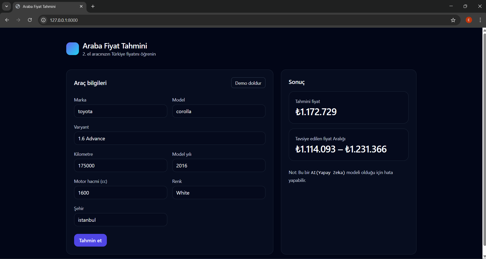

# 🚗 Araba Fiyat Tahmini — Turkey Used Car Price Predictor

> Türkiye ikinci el otomobil piyasası için makine öğrenmesi tabanlı fiyat tahmin uygulaması.


---

## 📸 Ekran Görüntüsü



> Araç bilgilerini girin, yapay zeka modelimiz tahmini fiyatı ve önerilen fiyat aralığını anında hesaplasın.

---

## 🎯 Proje Hakkında

Bu proje, Türkiye'deki ikinci el araç piyasasına ait **253.344 gerçek ilan** üzerinde eğitilmiş bir **XGBoost** regresyon modeli kullanarak araç fiyat tahmini yapar.

Kullanıcı; marka, model, varyant, kilometre, model yılı, motor hacmi, renk ve şehir bilgilerini girerek anlık fiyat tahmini ve önerilen fiyat aralığı alabilir.

---

## 📊 Veri Seti

Türkiye'nin önde gelen ikinci el araç platformlarından derlenen gerçek ilan verisi kullanılmıştır.

| Özellik           | Değer                      |
| ----------------- | -------------------------- |
| Ham kayıt sayısı  | 253.344                    |
| Temizleme sonrası | 250.121                    |
| Marka sayısı      | 22                         |
| Model sayısı      | 143                        |
| Varyant sayısı    | 2.118                      |
| Renk sayısı       | 18                         |
| Şehir sayısı      | 81                         |
| Yıl aralığı       | 1972 – 2025                |
| Fiyat aralığı     | 100.000 TL – 10.000.000 TL |
| Ortalama fiyat    | 1.094.579 TL               |
| Medyan fiyat      | 879.000 TL                 |

| Sütun     | Açıklama          |
| --------- | ----------------- |
| `brand`   | Araç markası      |
| `model`   | Araç modeli       |
| `variant` | Varyant / paket   |
| `km`      | Kilometre bilgisi |
| `year`    | Model yılı        |
| `color`   | Araç rengi        |
| `city`    | İlan şehri        |
| `price`   | Satış fiyatı (TL) |

---

## 🏆 Performans Metrikleri

5 farklı model karşılaştırılmış, **XGBoost** en iyi sonucu vermiştir. Hiperparametre optimizasyonu (`RandomizedSearchCV`, 3-fold CV) ile model daha da iyileştirilmiştir.

### Model Karşılaştırması

| Model             | MAE (TL)   | RMSE (TL)   | R²         |
| ----------------- | ---------- | ----------- | ---------- |
| Linear Regression | 149.257    | 328.082     | 0.9214     |
| Random Forest     | 133.281    | 244.164     | 0.9283     |
| Gradient Boosting | 85.190     | 150.744     | 0.9644     |
| LightGBM          | 91.974     | 168.757     | 0.9614     |
| **XGBoost**       | **84.637** | **149.423** | **0.9649** |

### ✅ Final Model (XGBoost — Tuned)

| Metrik       | Değer          | Açıklama                       |
| ------------ | -------------- | ------------------------------ |
| **R² Skoru** | **0.9665**     | Varyansın %96,65'i açıklanıyor |
| **MAE**      | **80.341 TL**  | Ortalama mutlak hata           |
| **RMSE**     | **139.915 TL** | Karekök ortalama kare hata     |

> Hiperparametre optimizasyonu: `n_estimators=800`, `max_depth=10`, `learning_rate=0.05`, `subsample=0.9`, `colsample_bytree=0.9`

---

## ✨ Özellikler

- 🤖 **XGBoost** tabanlı makine öğrenmesi modeli
- 📊 Log-fiyat dönüşümü + kalibrasyon ile geliştirilmiş tahmin doğruluğu
- 🎯 Tahmini fiyat + güven aralığı gösterimi
- 🔍 Otomatik tamamlama (marka, model, varyant, renk, şehir)
- 🐳 Docker ile kolayca çalıştırılabilir
- ⚡ FastAPI ile hızlı REST API
- 🌙 Modern dark mode arayüz (Tailwind CSS)

---

## 🛠️ Kullanılan Teknolojiler

| Katman           | Teknoloji                                |
| ---------------- | ---------------------------------------- |
| Backend          | FastAPI, Uvicorn                         |
| ML               | XGBoost, scikit-learn, category_encoders |
| Veri İşleme      | Pandas, NumPy                            |
| Frontend         | HTML, Tailwind CSS (vanilla JS)          |
| Containerization | Docker                                   |
| Validasyon       | Pydantic v2                              |

---

## 📁 Proje Yapısı

```
CarPricePredict/
├── app/
│   ├── api/
│   │   ├── __init__.py
│   │   └── routes.py          # API endpoint'leri
│   ├── services/
│   │   ├── __init__.py
│   │   └── predictor.py       # ML tahmin motoru
│   ├── __init__.py
│   ├── main.py                # FastAPI uygulama girişi
│   └── schemas.py             # Pydantic veri modelleri
├── data/
│   └── turkey_used_cars.csv   # Eğitim veri seti
├── docs/
│   └── screenshot.png         # Uygulama ekran görüntüsü
├── frontend/
│   └── index.html             # Web arayüzü
├── models/
│   └── car_price_model.pkl    # Eğitilmiş ML modeli
├── notebooks/
│   └── CarDataAnalysis.ipynb  # Veri analizi & model eğitimi
├── Dockerfile
├── .dockerignore
└── requirements.txt
```

---

## 🚀 Kurulum ve Çalıştırma

### Yöntem 1: Docker (Önerilen)

```bash
# Repoyu klonla
git clone https://github.com/eyyupkln/car-price-prediction.git
cd car-price-prediction

# Image'ı oluştur
docker build -t car-price-prediction .

# Container'ı başlat
docker run -p 8000:8000 car-price-prediction
```

Tarayıcıda aç: [http://127.0.0.1:8000](http://127.0.0.1:8000)

---

### Yöntem 2: Manuel Kurulum

```bash
# Repoyu klonla
git clone https://github.com/eyyupkln/car-price-prediction.git
cd car-price-prediction

# Sanal ortam oluştur
python -m venv .venv
source .venv/bin/activate   # Windows: .venv\Scripts\activate

# Bağımlılıkları yükle
pip install -r requirements.txt

# Uygulamayı başlat
uvicorn app.main:app --reload
```

---

## 📡 API Endpoints

| Method | Endpoint       | Açıklama                    |
| ------ | -------------- | --------------------------- |
| `GET`  | `/`            | Web arayüzü                 |
| `GET`  | `/api/health`  | Sağlık kontrolü             |
| `GET`  | `/api/options` | Marka/model/şehir listeleri |
| `POST` | `/api/predict` | Fiyat tahmini               |

### Örnek İstek

```bash
curl -X POST "http://127.0.0.1:8000/api/predict" \
  -H "Content-Type: application/json" \
  -d '{
    "features": {
      "brand": "toyota",
      "model": "corolla",
      "variant": "1.6 Advance",
      "km": 175000,
      "color": "White",
      "city": "istanbul",
      "year": 2016,
      "engine_cc": 1600
    }
  }'
```

### Örnek Yanıt

```json
{
  "predicted_price": 1172729,
  "predicted_price_lower": 1114093,
  "predicted_price_upper": 1231366
}
```

---

## 🧠 Model Detayları

- **Algoritma:** XGBoost Regressor
- **Hedef Değişken:** `log1p(price)` — fiyat dağılımını normalleştirmek için logaritmik dönüşüm uygulandı
- **Özellikler:** `brand`, `model`, `variant`, `km`, `color`, `city`, `car_age`, `engine_cc`
- **Kategorik Encoding:** Düşük kardinalite → OneHotEncoder | Yüksek kardinalite → TargetEncoder
- **Kalibrasyon:** Model çıktısı doğrusal regresyon ile kalibre edildi
- **Optimizasyon:** RandomizedSearchCV ile hiperparametre arama (3-fold CV, 10 iterasyon)

---

## ⚙️ Gereksinimler

```
Python >= 3.11
fastapi==0.115.0
uvicorn[standard]==0.30.6
pydantic==2.9.2
pandas==2.2.3
numpy==1.26.4
scikit-learn==1.5.2
xgboost==2.1.1
category_encoders==2.6.3
```

---

## 🤝 Katkıda Bulunma

1. Projeyi fork'layın
2. Feature branch oluşturun (`git checkout -b feature/yeni-ozellik`)
3. Değişikliklerinizi commit'leyin (`git commit -m 'feat: yeni özellik eklendi'`)
4. Branch'inizi push'layın (`git push origin feature/yeni-ozellik`)
5. Pull Request açın

---

## 📝 Lisans

Bu proje MIT lisansı altında dağıtılmaktadır.

---

## 👤 Geliştirici

**Eyyüp Kalan**

[](https://www.linkedin.com/in/eyyupklnn/)
[](https://github.com/eyyupkln)

---

> ⚠️ **Not:** Bu uygulama bir yapay zeka modeli olduğundan tahminler referans amaçlıdır, kesin fiyat bilgisi sunmaz.

---

<br>

---

# 🚗 Car Price Prediction — Turkey Used Car Price Estimator

> A machine learning–powered price prediction app for Turkey's second-hand car market.


---

## 📸 Screenshot


> Enter your vehicle details and let our AI model instantly estimate the market price and recommended price range.

---

## 🎯 About the Project

This project uses an **XGBoost** regression model trained on **253,344 real listings** from Turkey's used car market to predict second-hand vehicle prices.

Users can enter details such as brand, model, variant, mileage, year, engine displacement, color, and city — and receive an instant price estimate along with a confidence interval.

---

## 📊 Dataset

A real-world dataset of used car listings scraped from Turkey's leading second-hand car platforms.

| Feature            | Value                        |
| ------------------ | ---------------------------- |
| Raw records        | 253,344                      |
| After cleaning     | 250,121                      |
| Number of brands   | 22                           |
| Number of models   | 143                          |
| Number of variants | 2,118                        |
| Number of colors   | 18                           |
| Number of cities   | 81                           |
| Year range         | 1972 – 2025                  |
| Price range        | 100,000 TRY – 10,000,000 TRY |
| Average price      | 1,094,579 TRY                |
| Median price       | 879,000 TRY                  |

| Column    | Description      |
| --------- | ---------------- |
| `brand`   | Car brand        |
| `model`   | Car model        |
| `variant` | Trim / package   |
| `km`      | Mileage          |
| `year`    | Model year       |
| `color`   | Car color        |
| `city`    | Listing city     |
| `price`   | Sale price (TRY) |

---

## 🏆 Performance Metrics

5 different models were benchmarked and **XGBoost** achieved the best results. The model was further improved through hyperparameter tuning using `RandomizedSearchCV` with 3-fold cross-validation.

### Model Comparison

| Model             | MAE (TRY)  | RMSE (TRY)  | R²         |
| ----------------- | ---------- | ----------- | ---------- |
| Linear Regression | 149,257    | 328,082     | 0.9214     |
| Random Forest     | 133,281    | 244,164     | 0.9283     |
| Gradient Boosting | 85,190     | 150,744     | 0.9644     |
| LightGBM          | 91,974     | 168,757     | 0.9614     |
| **XGBoost**       | **84,637** | **149,423** | **0.9649** |

### ✅ Final Model (XGBoost — Tuned)

| Metric       | Value           | Description                        |
| ------------ | --------------- | ---------------------------------- |
| **R² Score** | **0.9665**      | 96.65% of price variance explained |
| **MAE**      | **80,341 TRY**  | Mean Absolute Error                |
| **RMSE**     | **139,915 TRY** | Root Mean Squared Error            |

> Best hyperparameters: `n_estimators=800`, `max_depth=10`, `learning_rate=0.05`, `subsample=0.9`, `colsample_bytree=0.9`

---

## ✨ Features

- 🤖 **XGBoost**-based machine learning model
- 📊 Improved accuracy via log-price transformation and linear calibration
- 🎯 Predicted price + confidence interval display
- 🔍 Autocomplete for brand, model, variant, color, and city
- 🐳 Easy deployment with Docker
- ⚡ Fast REST API powered by FastAPI
- 🌙 Modern dark-mode UI with Tailwind CSS

---

## 🛠️ Tech Stack

| Layer            | Technology                               |
| ---------------- | ---------------------------------------- |
| Backend          | FastAPI, Uvicorn                         |
| ML               | XGBoost, scikit-learn, category_encoders |
| Data Processing  | Pandas, NumPy                            |
| Frontend         | HTML, Tailwind CSS (vanilla JS)          |
| Containerization | Docker                                   |
| Validation       | Pydantic v2                              |

---

## 📁 Project Structure

```
CarPricePredict/
├── app/
│   ├── api/
│   │   ├── __init__.py
│   │   └── routes.py          # API endpoints
│   ├── services/
│   │   ├── __init__.py
│   │   └── predictor.py       # ML prediction engine
│   ├── __init__.py
│   ├── main.py                # FastAPI app entry point
│   └── schemas.py             # Pydantic data models
├── data/
│   └── turkey_used_cars.csv   # Training dataset
├── docs/
│   └── screenshot.png         # App screenshot
├── frontend/
│   └── index.html             # Web interface
├── models/
│   └── car_price_model.pkl    # Trained ML model
├── notebooks/
│   └── CarDataAnalysis.ipynb  # EDA & model training
├── Dockerfile
├── .dockerignore
└── requirements.txt
```

---

## 🚀 Getting Started

### Option 1: Docker (Recommended)

```bash
# Clone the repository
git clone https://github.com/eyyupkln/car-price-prediction.git
cd car-price-prediction

# Build the image
docker build -t car-price-prediction .

# Run the container
docker run -p 8000:8000 car-price-prediction
```

Open in browser: [http://127.0.0.1:8000](http://127.0.0.1:8000)

---

### Option 2: Manual Setup

```bash
# Clone the repository
git clone https://github.com/eyyupkln/car-price-prediction.git
cd car-price-prediction

# Create virtual environment
python -m venv .venv
source .venv/bin/activate   # Windows: .venv\Scripts\activate

# Install dependencies
pip install -r requirements.txt

# Start the application
uvicorn app.main:app --reload
```

---

## 📡 API Endpoints

| Method | Endpoint       | Description                |
| ------ | -------------- | -------------------------- |
| `GET`  | `/`            | Web interface              |
| `GET`  | `/api/health`  | Health check               |
| `GET`  | `/api/options` | Brand / model / city lists |
| `POST` | `/api/predict` | Price prediction           |

### Sample Request

```bash
curl -X POST "http://127.0.0.1:8000/api/predict" \
  -H "Content-Type: application/json" \
  -d '{
    "features": {
      "brand": "toyota",
      "model": "corolla",
      "variant": "1.6 Advance",
      "km": 175000,
      "color": "White",
      "city": "istanbul",
      "year": 2016,
      "engine_cc": 1600
    }
  }'
```

### Sample Response

```json
{
  "predicted_price": 1172729,
  "predicted_price_lower": 1114093,
  "predicted_price_upper": 1231366
}
```

---

## 🧠 Model Details

- **Algorithm:** XGBoost Regressor
- **Target Variable:** `log1p(price)` — logarithmic transformation applied to normalize the price distribution
- **Features:** `brand`, `model`, `variant`, `km`, `color`, `city`, `car_age`, `engine_cc`
- **Categorical Encoding:** Low cardinality → OneHotEncoder | High cardinality → TargetEncoder
- **Calibration:** Raw model output is post-calibrated using linear regression
- **Optimization:** Hyperparameter search via RandomizedSearchCV (3-fold CV, 10 iterations)

---

## ⚙️ Requirements

```
Python >= 3.11
fastapi==0.115.0
uvicorn[standard]==0.30.6
pydantic==2.9.2
pandas==2.2.3
numpy==1.26.4
scikit-learn==1.5.2
xgboost==2.1.1
category_encoders==2.6.3
```

---

## 🤝 Contributing

1. Fork the repository
2. Create a feature branch (`git checkout -b feature/new-feature`)
3. Commit your changes (`git commit -m 'feat: add new feature'`)
4. Push to the branch (`git push origin feature/new-feature`)
5. Open a Pull Request

---

## 📝 License

This project is distributed under the MIT License.

---

## 👤 Developer

**Eyyüp Kalan**

[](https://www.linkedin.com/in/eyyupklnn/)
[](https://github.com/eyyupkln)

---

> ⚠️ **Note:** This application is powered by an AI model. Predictions are for reference purposes only and do not guarantee exact market prices.
